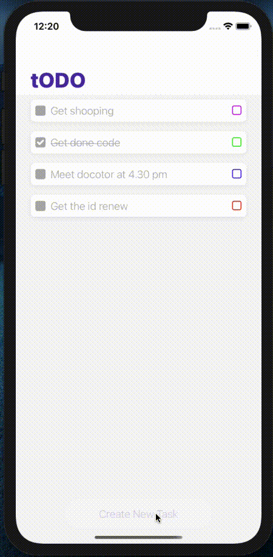

 

# toDo

## toDo is the focus to manage task easily.

 

## ⭐️ tech stack

- [nativego](https://github.com/damithg-dev/react-native-template-nativego)
- [redux](https://redux.js.org/introduction/getting-started)
- [redux-persist](https://github.com/rt2zz/redux-persist)

## ➡️ to run.

    git clone https://github.com/damithg-dev/todo.git && cd todo && npm install

## 📱 Screen.

hello 1
